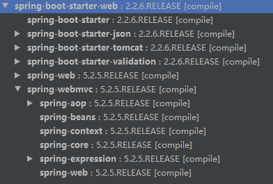

[TOC]
# spring-stack

本人学习 spring 技术栈的一些 demo。

## 001-spring-hello

要点：

### 1. 从`start.spring.io`快速构建项目

https://start.spring.io

构建的项目有以下功能：
- 包含基本项目骨架
- 基于 spring boot
- 可以选择一些 spring 生态圈的依赖

### 2. 第一个 REST API

1. 引入`spring-boot-starter-web`依赖，项目中即引入了如下依赖：
    

2. 使用`@RestController`标记一个类（@RestController = @Controller + @ResponseBody），@Controller
将当前修饰的类注入 Spring IOC 容器，在该类所在的项目启动的过程中，这个类就被实例化。当然也有语义化的作用，
即代表该类是一个 Controller 的作用。

3. 使用`@RequestMapping`标记一个方法，例如：`@GetMapping("/hello")`，在方法中返回任意字符串，例如`hello world`。

4. 启动项目，访问`localhost:8080/hello`。

### 3.启用应用自省和监控功能

引入`spring-boot-starter-actuator`依赖，启动对应用系统的自省和监控的集成功能，详情看 pom 文件中的注释。

### 4. 在 maven 中使用 spring boot

需要在 pom 文件中设置 \<parent> 标签和 spring boot plugin，如下：

1. 设置 parent
     ```xml
     <parent>
         <groupId>org.springframework.boot</groupId>
         <artifactId>spring-boot-starter-parent</artifactId>
         <version>2.2.6.RELEASE</version>
         <relativePath/> <!-- lookup parent from repository -->
     </parent>
     ```
2. 添加 spring-boot-maven-plugin 插件
     ```xml
     <build>
         <plugins>
             <!-- 此插件的说明：https://gist.github.com/roveyx/211d7b108b06116f33dab4ee4d6f22a3 -->
             <plugin>
                 <groupId>org.springframework.boot</groupId>
                 <artifactId>spring-boot-maven-plugin</artifactId>
             </plugin>
         </plugins>
     </build>
     ```

设置 parent 为 spring-boot-starter-parent 的主要作用是，此工程引用了大量依赖，并且排除了依赖冲突，故在使用被引用的依赖时，也不需要指定版本号。

### 5. 无法设置 \<parent> 为 spring-boot-starter-parent 的处理方法

如果因为某种原因无法设置 \<parent> 为 spring-boot-starter-parent，如下处理：

1. 在 dependencyManagement 设置：
     ```xml
     <dependencyManagement>
     	<dependencies>
     		<dependency>
     			<groupId>org.springframework.boot</groupId>
     			<artifactId>spring-boot-dependencies</artifactId>
     			<version>2.2.6.RELEASE</version>
     			<type>pom</type>
     			<scope>import</scope>
     		</dependency>
     	</dependencies>
     </dependencyManagement>
     ```
2. 在插件中如下设置：
     ```xml
     <build>
     	<plugins>
     		<plugin>
     			<groupId>org.springframework.boot</groupId>
     			<artifactId>spring-boot-maven-plugin</artifactId>
     			<version>2.2.6.RELEASE</version>
     			<executions>
     				<execution>
     					<goals>
     						<goal>repackage</goal>
     					</goals>
     				</execution>
     			</executions>
     		</plugin>
     	</plugins>
     </build>
     ```

	
	
	
	
	
	
	
	
	
	
	